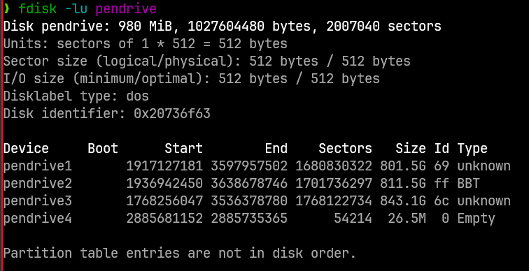
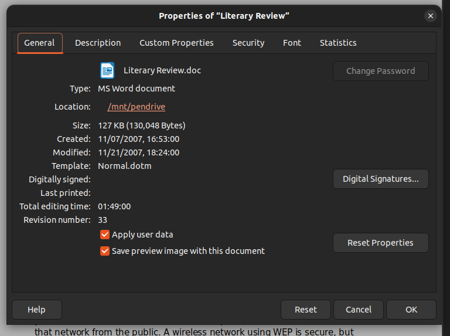

# Perícia digital

## 1 Hashes

### Tarefa: Confira o hash MD5 da imagem comprimida. Sempre faça isso.

Depois, calcule os hashes SHA1, SHA224, SHA256, SHA384 e SHA512 da imagem descomprimida,
colocando os resultados dentro de um arquivo.

Resultado do comando para obter o has MD5

`a093f2e85a7674ae873b555f31f6def5  pendrive.bz2`


Para obter os próximos hashes, vamos descomprimir a imagem, como foi pedido:


A imagem foi descomprimida para o arquivo pendrive, como mostra a imagem acima
Agora vamos obter os hashes SHA1, SHA224, SHA256, SHA384 e SHA512.
Para isso, criei um bash que rodará todos os comandos de uma vez


A imagem acima mostra os hashes em ordem:

```bash
sha1sum pendrive
sha224sum pendrive
sha256sum pendrive
sha384sum pendrive
sha512sum pendrive
```

## 2 Filsystem

### Tarefa: Qual filesystem foi utilizado no pendrive? (file / hexedit / fsstat)


file. Imagem 4


hexedit. Imagem 5


fsstat. Imagem 6

Pelos prints acima, conseguimos ver que o filesystem utilizado é o Fat32

## 3 Setores

### Tarefa: Quantos setores possui o pendrive? (file / fsstat / fdisk -lu)


fdisk. Imagem 7

Pelas imagens 6(fsstat) e 7(fdisk) podemos ver que o número de setores da imagem é `2.007.040`

## 4 Arquivos acessíveis

### Tarefa: Quantos arquivos estão acessíveis para usuários? (fls -ruF + grep -v + wc -l / find + wc -l no ponto de montagem)

Utilizando o comando `fls`, podemos ver os arquivos disponíveis:


fls. Imagem 8

Na imagem acima podemos ver arquivos listados, sendo 1 o nome do volume de entrada, 10 arquivos regulares (r/r) e 3 entradas de volume (v/v)
Temos então, 10 arquivos acessíveis


find. Imagem 9

Na imagem acima, rodei um comando para contar o número de arquivos regulares acessíveis, com o retorno de 10

## 5 Tipos de arquivos

### Tarefa: Quais tipos de arquivos estão acessíveis para usuários? (sorter -d / find -type f + egrep -o + sort -u)


find 2. Imagem 10

Na imagem acima podemos ver um comando utilizado para obter, sem duplicatas, os tipos de extensões disponíveis dentro do pendrive

## 6 Arquivo Literary Review

### Tarefa: Qual é o inode do arquivo "Literary Review.doc" dentro da imagem original? (fls -rF)


inode. Imagem 11

Na imagem acima, podemos ver o uso do comando `fls -rf` na imagem do pendrive para obter o inode do arquivo
Literary Review.doc

Podemos ver 2 entradas do arquivo, uma com _ e outra sem. Aqui estamos procurando a entrada que não contem o _,
então o inode do arquivo é `18`

## 7 Inode do arquivo Literary Review

### Tarefa: Qual é o inode do arquivo "Literary Review.doc" no ponto de montagem, dentro do filesystem do seu HD? (ls -li / stat)


inode 2. Imagem 12

No print vemos os comandos `ls -li` e `stat` sendo rodados sobre o arquivo.
Podemos ver na imagem que o inode do arquivo no ponto de montagem é 8.

## 8 Diferença de inode do arquivo Literary Review

### Tarefa: Explique porque há uma diferença no número dos inodes encontrados nos dois itens anteriores e cite qual deles é o correto para referenciar o arquivo em questão.

Há uma diferença porque os dois arquivos, mesmo sendo o mesmo arquivo, estão em contextos diferentes.
Quando o comando fls -rf é utilzado na imagem do pendrive, estamos vendo o inode do arquivo dentro da própria imagem.
Esse inode não tem relação com o nosso sistema, mas apenas com o sistema de arquivos da imagem.
Ao montar a imagem e checar o inode novamente, estamos vendo o inode do arquivo dentro do nosso sistema de arquivos

## 9 e 10 Datas de criação, modificação e acesso do arquivo Literary Review

### Tarefa 9: Qual é a data da criação ou última modificação do arquivo "Literary Review.doc" no filesystem? (fls -rF ou find + grep para encontrar o arquivo) (ls -l / stat / fls + istat para ver a data)

### Tarefa 10: Qual é a data do último acesso ao arquivo "Literary Review.doc" no filesystem? (fls ou find para encontrar o arquivo) (ls / stat / fls + istat)


istat. Imagem 13

Para obter a a data de criação e modificação, utilizei o comando `istat` da imagem acima.

- Podemos ver que a data de criação foi `Created:        2010-08-13 16:23:59 (-03)`.
- A data de alteração foi `Written:        2009-09-23 21:12:00 (-03)`.
- A data de acesso foi `Accessed:       2009-11-21 00:00:00 (-02)`.

Notando que as datas tem timezone.

## 11 datas no libreoffice

### Tarefa: Quais são as datas de criação e última modificação do conteúdo arquivo "Literary Review.doc"? (dados no próprio arquivo) (ooffice / libreoffice)\*

Para obter as datas de criação e última modificação do conteúdo do arquivo, vamos abrir o mesmo no LibreOffice e checar suas propriedades


libreoffice. Imagem 14

Como podemos ver na imagem, as datas de criação e modificação são, respectivamente, 11/07/2007 e 11/21/2007

## 12, 13, 14 Criador, ultimo modificador e ultima impressão do arquivo Fernando_Porcella.xls

### Tarefa 12: Quem é o criador do conteúdo do arquivo "Fernando_Porcella.xls"? (dados no próprio arquivo) (ooffice / libreoffice / file)

### Tarefa 13: Quem foi a última pessoa que modificou conteúdo do arquivo "Fernando_Porcella.xls"? (dados no próprio arquivo) (ooffice / libreoffice / file)

### Tarefa 14: Quando se deu a última impressão do conteúdo do arquivo "Fernando_Porcella.xls"? (dados no próprio arquivo) (ooffice / libreoffice)\*

Como na tarefa anterior, vamos abrir o arquivo no libreoffice e checar seus dados.
Pelos comandos anteriores, sabemos que o arquivo se encontra dentro da pasta `documentos/diversos`


libreoffice 2. Imagem 15

Como podemos ver na imagem 15, o criador do arquivo é `Mundial Sudafrica`.
O ultimo a modificar o conteúdo do arquivo é `fporcella`.
A última impressão foi feita em 14 de março de 2010 as 22h56.

## 15 e 16 Arquivo paola-carvalho.jpg

### Tarefa: 15 Qual foi a data da última modificação do conteúdo da foto "paola-carvalho.jpg"? (dados no próprio arquivo) (strings + grep / hexedit)

### Tarefa: 16 Qual foi o software utilizado para fazer a modificação do conteúdo da foto "paola-carvalho.jpg"? (dados no próprio arquivo) (strings + grep / hexedit)

Pelas informações descobertas anteriormente, sabemos que o arquivo paola-carvalho.jpg se encontra na pasta `fotos`


hexedit paola carvalho. Imagem 16


strings paola carvalho. Imagem 17

Na imagem acima, vemos o resuldado do comando `hexedit` que mostra que o software utilizado foi o
Adobe Photoshop CS Windows na data 19/12/2008

Utilizando o comando strings, conseguimos confirmar essas informações.

## 17 documento sec-us-networkbasedfirewallservice.pdf

### Tarefa: Qual foi o software utilizado para produzir o documento "sec-us-networkbasedfirewallservice.pdf"? (evince / okular / strings / strings + grep / hexedit)

O documento sec-us-networkbasedfirewallservice.pdf se encontra na pasta `documentos/rede/`


strings sec-us-networkbasedfirewallservice.pdf. Imagem 18

Utilizando o grep do strings do arquivo, podemos ver que ele foi criado no Adobe Illustrator CS3

## 18 Data de modificacao de 1632-1640.pdf

### Tarefa: Qual foi a data de modificação do conteúdo do documento "1632-1640.pdf"? (dados no próprio arquivo) (evince / okular / strings + grep / hexedit)

O arquivo 1632-1640.pdf tambem se encontra na pasta documentos/rede


strings 1632-1640.pdf. Imagem 19

Na imagem 19 podemos ver que a ultima modificação do arquivo 1632-1640.pdf foi em 20/07/2010 as 15h02

## 19 Criador de 1632-1640.pdf

### Tarefa Quem criou o conteúdo do documento “1632-1640.pdf”? (dados no próprio arquivo) (evince / okular / strings + grep / hexedit)

utilizando o hexedit e o strings, ou lendo as propriedades do arquivo, não foi encontrado o nome do autor, pois o seu produtor e criador aparentam ser os nomes dos programas que o criaram, como podemos ver na imagem 20 e 21 a seguir:


1632-1640 autor. Imagem 20


1632-1640 autor 2. Imagem 21

O criador obtido através desses métodos foi PScript5.dll

## 20 Vericidade das datas

### Tarefa: Pode-se afirmar que todas as datas levantadas nas perguntas anteriores são verídicas? Por quê?

Não podemos afirmar que as datas são verídicas. Metadados de arquivos podem ser alterados por softwares especializados, ou até mesmo por comandos de copiar e colar. Eles também podem mudar dependendo do funcionamento dos sistemas operacionais por onde passaram. Possíveis alterações de dados de arquivos devem sempre ser levados em consideração

## 21 Extração de imagens em “sec-us-networkbasedfirewallservice.pdf” e “1632-1640.pdf”

### Tarefa: Dentro dos arquivos “sec-us-networkbasedfirewallservice.pdf” e “1632-1640.pdf” existem figuras JPG. Extraia as mesmas. (foremost -Tat jpg arquivo)

as imagens extraidas foram:

1632-1640.pdf


sec-us-networkbasedfirewallservice


as imagens estão presentes na pasta ./[nome-do-arquivo]/jpg

## 23 Arquivos deletados

### Tarefa: Qual é o referido animal? (fls -rdF + istat + icat ou fls -rdFl + icat)

### Tarefa: Qual foi a provável data da última modificação do conteúdo da foto? (strings + grep)


arquivos deletados. Imagem 22

Acima temos uma imagem do comando mostrando todos os arquivos deletados na imagem. Dela, podemos ver que fotos de caes foram deletadas

Agora podemos utilizar o istat para pegar informaçoes sobre as imagens deletadas:


informações de fotos deletadas. Imagem 23

Podemos ver que a data provável da última modificação foi em 13/08/2010 as 14h24
